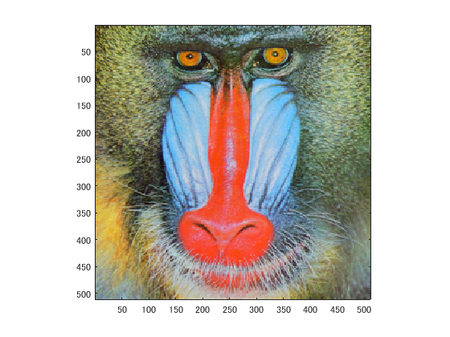
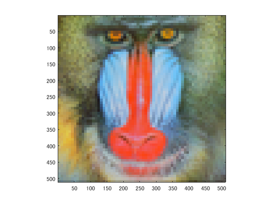
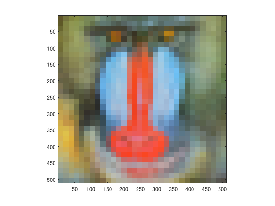
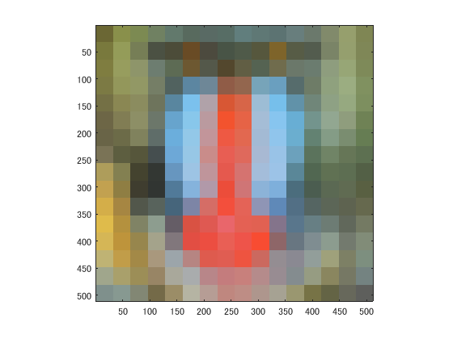

課題1では画像をダウンサンプリングして徐々に解像度が低くなるプログラムを動かした．
各メソッドにおいてIMGとIMG2の縮小拡大を行っている．
縮小は各メソッド費等しく0.5倍の大きさとなっているが，拡大はメソッドを追うごとに2倍ずつ倍率が高くなっており，
1画素当たりの大きさが大きくなっていくため，結果として画像が粗くなっている．

clear; % 変数のオールクリア

ORG=imread('Mandrill.png'); % 原画像の入力
imagesc(ORG); axis image; % 画像の表示
pause; % 一時停止
clear; % 変数のオールクリア

  図1 原画像

IMG = imresize(ORG,0.5); % 画像の縮小
IMG2 = imresize(IMG,2,'box'); % 画像の拡大
imagesc(IMG2); axis image; % 画像の表示
pause; % 一時停止

  図2 縮小画像1

IMG = imresize(IMG,0.5); % 画像の縮小
IMG2 = imresize(IMG,4,'box'); % 画像の拡大
imagesc(IMG2); axis image; % 画像の表示
pause; % 一時停止

  図3 縮小画像2

IMG = imresize(IMG,0.5); % 画像の縮小
IMG2 = imresize(IMG,8,'box'); % 画像の拡大
imagesc(IMG2); axis image; % 画像の表示
pause; % 一時停止

  図4 縮小画像3

IMG = imresize(IMG,0.5); % 画像の縮小
IMG2 = imresize(IMG,16,'box'); % 画像の拡大
imagesc(IMG2); axis image; % 画像の表示
pause; % 一時停止

  図5 縮小画像4

IMG = imresize(IMG,0.5); % 画像の縮小
IMG2 = imresize(IMG,32,'box'); % 画像の拡大
imagesc(IMG2); axis image; % 画像の表示

  図6 縮小画像5

