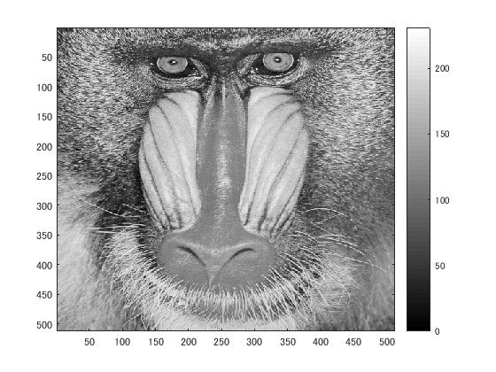
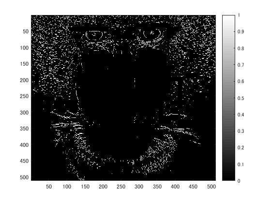
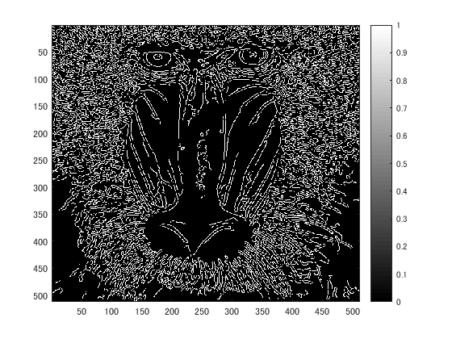

ORG = imread('Mandrill.png'); % 原画像の入力
ORG = rgb2gray(ORG); %カラーからグレイへの変換
imagesc(ORG); colormap('gray'); colorbar;% 画像表示
pause; % 一時停止

  図1　グレイ画像
IMG = edge(ORG,'prewitt'); % エッジ抽出（プレウィット法）
imagesc(IMG); colormap('gray'); colorbar;% 画像表示
pause; % 一時停止

  図2　プレウィット法
  
IMG = edge(ORG,'sobel'); % エッジ抽出（ソベル法）
imagesc(IMG); colormap('gray'); colorbar;% 画像表示
pause; % 一時停止

  図3 ソベル法

IMG = edge(ORG,'canny'); % エッジ抽出（キャニー法）
imagesc(IMG); colormap('gray'); colorbar;% 画像表示
pause; % 一時停止

  図4　キャニー法
