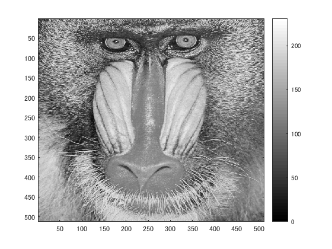

今回，閾値別の画像を生成するプログラムを作成した．
閾値とは計算機に入力する段階での濃度の基準値であり，
閾値処理では設定した閾値より明るいか暗いかによって，画素を0か1(黒か白)の2値二変換する方式である．
プログラムでは原画像を白黒濃淡画像に変換した後，閾値を64，96，128，192にそれぞれ設定した時の閾値処理を行った．
どの閾値の処理画像でも違いを確認することができた．

clear; % 変数のオールクリア

ORG=imread('Mandrill.png'); % 原画像の入力
ORG= rgb2gray(ORG); % カラー画像を白黒濃淡画像へ変換

imagesc(ORG); colormap(gray); colorbar; % 画像の表示
pause;

  図1 白黒濃淡
IMG = ORG > 64; % 輝度値が64以上の画素を1，その他を0に変換
imagesc(IMG); colormap(gray); colorbar;
pause;

  図2 輝度値64以上
  
IMG = ORG > 96;
imagesc(IMG); colormap(gray); colorbar;
pause;

  図3 輝度値96以上
  

IMG = ORG > 128;
imagesc(IMG); colormap(gray); colorbar;
pause;

  図4 輝度値128以上
  

IMG = ORG > 192;
imagesc(IMG); colormap(gray); colorbar;

  図5 輝度値192以上
  
