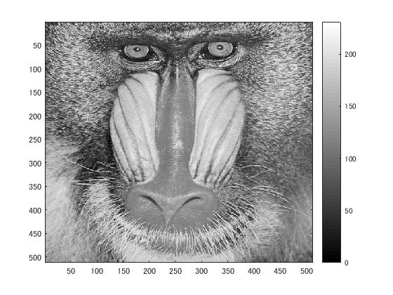
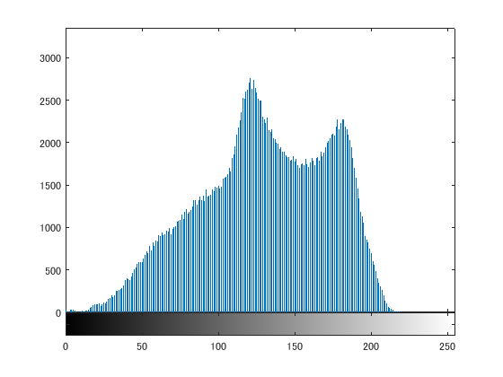

今回，原画像の濃度ヒストグラムを生成するプログラムを作成した．
濃度ヒストグラムとはディジタル画像における各濃度値の出現頻度を表すグラフである．
縦軸に出現頻度，横軸に濃度値を採る．
濃度ヒストグラムが全く同じであったとしても原画像が同じであるとは限らない．
プログラムでは原画像を白黒濃淡画像に変換した後，濃度ヒストグラムを生成した．
濃度ヒストグラムより濃度値が130前後が最も多く出現していることが分かる．

clear; % 変数のオールクリア

ORG=imread('Mandrill.png'); % 原画像の入力
ORG=rgb2gray(ORG); % カラー画像を白黒濃淡画像へ変換
imagesc(ORG); colormap(gray); colorbar;
pause;

  図1 白黒濃淡画像
  
imhist(ORG); % ヒストグラムの表示

  図2 ヒストグラム
  
