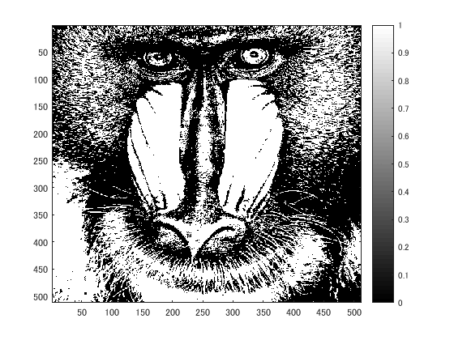
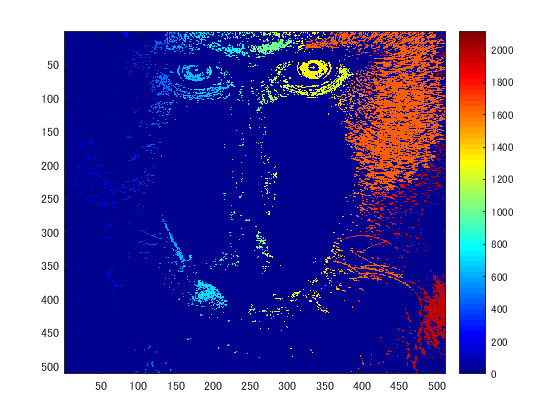

ORG = imread('Mandrill.png'); % 画像の読み込み
ORG = rgb2gray(ORG); % 白黒濃淡画像に変換
imagesc(ORG); colormap(gray); colorbar; % 画像の表示
pause;

  図1　白黒濃淡画像
IMG = ORG > 128; % 閾値128で二値化
imagesc(IMG); colormap(gray); colorbar; % 画像の表示
pause;

  図2　閾値128
IMG = bwlabeln(IMG);
imagesc(IMG); colormap(jet); colorbar; % 画像の表示
pause;

  図3 カラー表示
