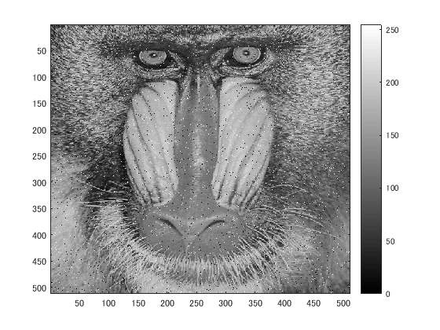
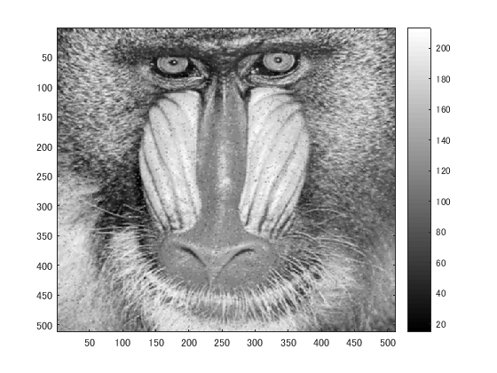
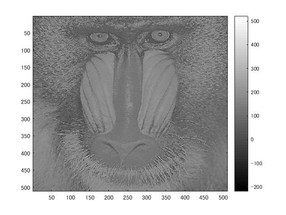

clear;
ORG = imread('Mandrill.png'); % 画像の読み込み
ORG = rgb2gray(ORG); % 白黒濃淡画像に変換
imagesc(ORG); colormap(gray); colorbar; % 画像の表示
pause;

  図1　白黒濃淡画像
ORG = imnoise(ORG,'salt & pepper',0.02); % ノイズ添付
imagesc(ORG); colormap(gray); colorbar; % 画像の表示
pause;

  図2　ノイズ添付
  
IMG = filter2(fspecial('average',3),ORG); % 平滑化フィルタで雑音除去
imagesc(IMG); colormap(gray); colorbar; % 画像の表示
pause;

  図3　平滑
IMG = medfilt2(ORG,[3 3]); % メディアンフィルタで雑音除去
imagesc(IMG); colormap(gray); colorbar; % 画像の表示
pause;

  図4 雑音除去後
  
f=[0,-1,0;-1,5,-1;0,-1,0]; % フィルタの設計
IMG = filter2(f,IMG,'same'); % フィルタの適用
imagesc(IMG); colormap(gray); colorbar; % 画像の表示
pause;

  図5 フィルタ適用後
